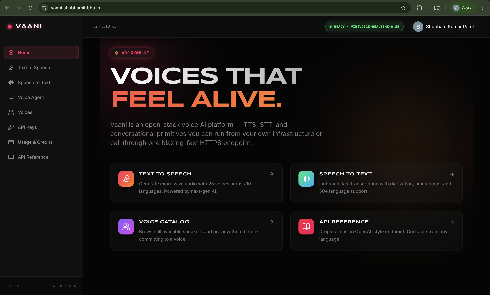
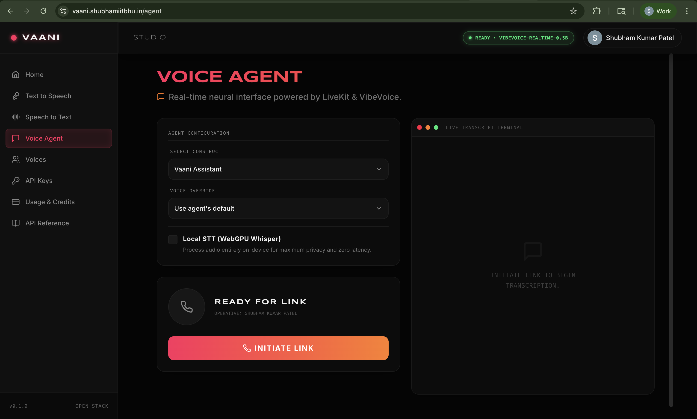
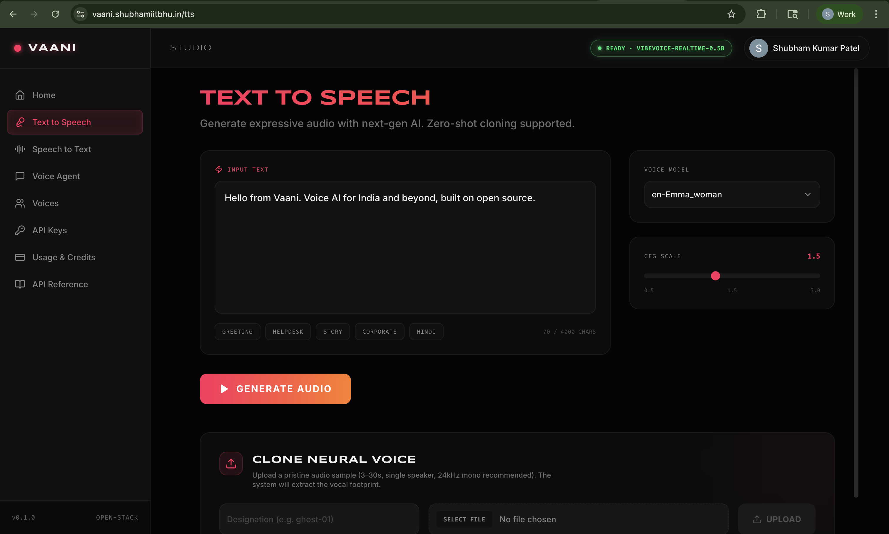
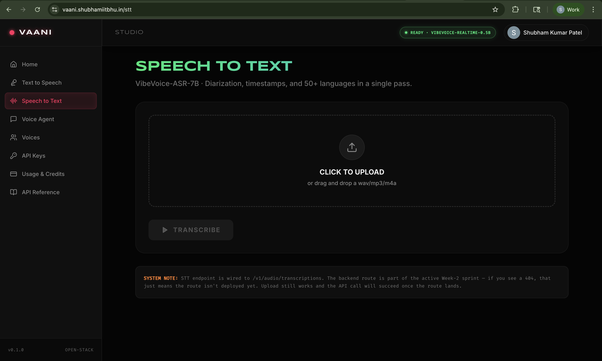
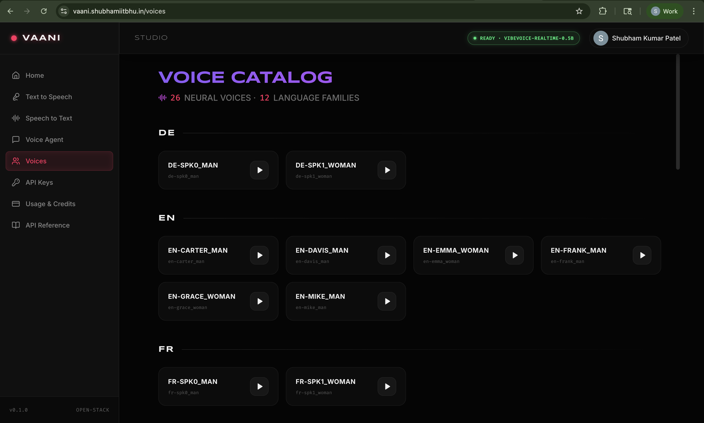
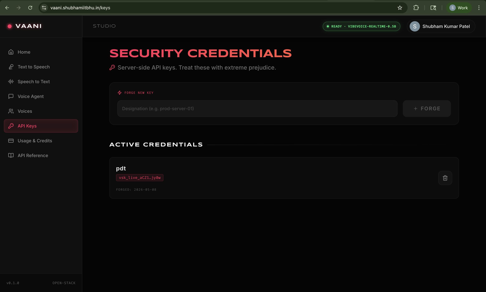
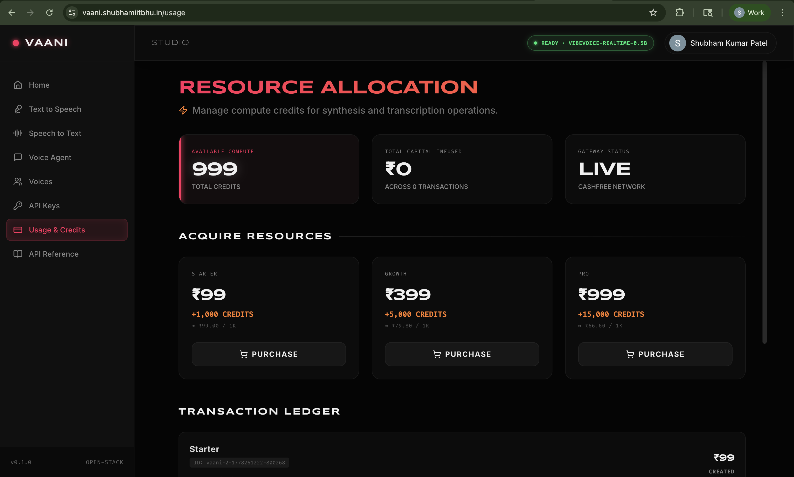

# 🎙️ Vaani

> **Open-stack voice AI platform.** TTS, STT, voice cloning, and real-time voice agents — all running on your own GPU. Built on VibeVoice + community models, with a Sarvam-style Studio frontend.

**Live:** [vaani.shubhamiitbhu.in](https://vaani.shubhamiitbhu.in) · **API:** [vaani-api.shubhamiitbhu.in](https://vaani-api.shubhamiitbhu.in) · **LiveKit:** `wss://livekit.shubhamiitbhu.in`

---

## Screenshots

| | |
|---|---|
|  |  |
| **Home** — Studio dashboard with the four pillars: TTS, STT, Voice Agent, Voice Catalog. | **Voice Agent** — real-time WebRTC call. VAD → STT (Groq Whisper *or* in-browser WebGPU Whisper) → Qwen3-32B → VibeVoice TTS. Live waveform animation, agent picker, voice override. |
|  |  |
| **Text-to-Speech** — 25 voices across 10 languages, zero-shot voice cloning, CFG-scale slider, in-browser audio preview. | **Speech-to-Text** — drop a `.wav`/`.mp3`/`.m4a` and get text + speaker-labeled segments + timestamps. Powered by VibeVoice-ASR-7B (60-min single-pass). |
|  |  |
| **Voice Catalog** — preview every voice in one click, grouped by language family. | **API Keys** — `vsk_live_*` bearer tokens with create/list/revoke and last-used tracking. Same key authenticates against every `/v1/*` endpoint. |
|  |  |
| **Usage & Credits** — Cashfree-powered top-ups (₹99 / 1k credits, ₹399 / 5k, ₹999 / 15k), real-time payment history, balance card. | **Sign in** — email/password or Google. JWT + bcrypt + SQLite. |

> Screenshots live in [`docs/screenshots/`](docs/screenshots). Hard-refresh the live site if cached SPA shows older UI.

---

## What's inside

| Capability | Model | License | Worker |
|---|---|---|---|
| Streaming TTS · 25 voices · 10 langs | [microsoft/VibeVoice-Realtime-0.5B](https://huggingface.co/microsoft/VibeVoice-Realtime-0.5B) | MIT | main API (`:8001`) |
| Long-form STT · diarization · 50+ langs | [microsoft/VibeVoice-ASR-HF](https://huggingface.co/microsoft/VibeVoice-ASR) | MIT | STT worker (`:8002`) |
| Hindi TTS + zero-shot voice cloning | [tarun7r/vibevoice-hindi-1.5B](https://huggingface.co/tarun7r/vibevoice-hindi-1.5B) | MIT | Hindi worker (`:8003`) |
| Realtime LLM for the voice agent | Qwen3-32B via [Groq](https://groq.com) | API | Agent worker |
| Realtime STT (server-side path) | whisper-large-v3 via Groq | API | Agent worker |
| Realtime STT (in-browser path, opt-in) | [onnx-community/whisper-tiny](https://huggingface.co/onnx-community/whisper-tiny) | MIT | Browser (WebGPU + Transformers.js) |
| Self-hosted realtime media | [LiveKit](https://github.com/livekit/livekit) | Apache 2.0 | Docker (host network) |

Hardware: a single **NVIDIA GH200 480 GB** (96 GB HBM3, ARM aarch64). About **20 GB VRAM** with all models loaded simultaneously.

---

## Architecture

```
        ┌──────────────────── Internet ──────────────────────┐
        │                          │                          │
        │  vaani.shubhamiitbhu.in  │  vaani-api.…             │  livekit.…
        │       (SPA)              │  (TTS + STT + auth)      │  (RTC signaling + media)
        ▼                          ▼                          ▼
                        Caddy (80/443, auto-HTTPS, Let's Encrypt)
                                   │
        ┌──────────────────────────┼─────────────────────────────────────┐
        │                          │                                     │
        │ vhost: vaani.…           │ vhost: vaani-api.…                  │ vhost: livekit.…
        │   → file_server          │   ┌── path /v1/audio/transcriptions │   → 127.0.0.1:7880
        │     /apps/studio/dist    │   │                                 │     (LiveKit Server,
        │                          │   ├── → 127.0.0.1:8002              │      Docker, host-net)
        │                          │   │   (STT worker, transformers 5.8)│
        │                          │   │                                 │
        │                          │   └── else                          │
        │                          │       → 127.0.0.1:8001              │
        │                          │       (main API, transformers 4.57) │
        │                          │           ├── voice hi-* /          │
        │                          │           │   user-…  → :8003       │
        │                          │           │   (community fork TTS)  │
        │                          │           ├── /v1/auth/* /v1/keys/* │
        │                          │           ├── /v1/billing/*         │
        │                          │           └── /v1/agent/token       │
        │                          │                                     │
        │                          │   Agent worker (separate proc) ─────┘
        │                          │     joins LiveKit rooms,
        │                          │     STT(Groq Whisper or browser)
        │                          │     + LLM(Groq Qwen3) + TTS(VaaniTTS)
        └──────────────────────────┴─────────────────────────────────────┘
```

**Four Python venvs** — incompatible `transformers` pins force separation:

| Venv | transformers | Used by |
|---|---|---|
| `~/vaani/.venv` | 4.57 | main API + streaming TTS (`vibevoice` pkg) |
| `~/vaani/.venv-stt` | 5.8 | STT worker (native `VibeVoiceAsr*`) |
| `~/vaani/.venv-tts-hi` | 4.51 | Hindi/community TTS (community vibevoice fork) |
| `~/vaani/.venv-agent` | (livekit-agents) | LiveKit agent worker |

Full deployment guide: [`docs/DEPLOYMENT.md`](docs/DEPLOYMENT.md).

---

## Repo layout

```
vaani/
├── apps/
│   ├── api/                  # FastAPI gateway (TTS + auth + billing + agent token)
│   │   ├── main.py
│   │   ├── auth.py           # SQLite + JWT + Google ID-token verify
│   │   ├── billing.py        # Cashfree integration
│   │   └── agent_routes.py   # LiveKit JWT minting
│   ├── stt_worker/           # FastAPI STT worker (VibeVoice-ASR)
│   ├── tts_hi_worker/        # FastAPI Hindi/cloning worker (community VibeVoice)
│   ├── agent/                # LiveKit voice-agent worker
│   │   ├── main.py
│   │   └── vaani_plugins.py  # custom STT/TTS bridges
│   ├── shared/
│   │   └── agent_presets.json   # 5 agent personalities (general/support/storyteller/tutor/hindi)
│   └── studio/               # Vite + React + TS + Tailwind SPA
│       ├── src/
│       │   ├── pages/        # Home · TTS · STT · Agent · Voices · Keys · Usage · Docs · Login · Signup
│       │   ├── components/   # Sidebar · UserMenu · StatusPill · VoiceWave · Select
│       │   └── lib/          # api · auth · use-whisper · whisper-worker
│       └── public/favicon.svg
├── infra/
│   ├── caddy/Caddyfile       # 3 vhosts (Studio · API+STT · LiveKit)
│   ├── livekit/config.yaml
│   └── systemd/              # vaani-{api,stt,tts-hi,agent,livekit}.service
├── scripts/
│   ├── bootstrap.sh          # one-shot fresh-server setup (idempotent)
│   ├── boom.sh               # boot/restart everything
│   └── deploy_remote.sh      # called by GitHub Actions
├── docs/
│   ├── DEPLOYMENT.md         # full deploy guide
│   └── screenshots/
└── .github/workflows/deploy.yml
```

---

## Quickstart on a fresh GPU box

```bash
# 1. Clone
git clone https://github.com/shubham21155102/vaani.git ~/vaani
cd ~/vaani

# 2. Fill in secrets
cp .env.example /home/ubuntu/vaani/.env
chmod 600 /home/ubuntu/vaani/.env
${EDITOR:-nano} /home/ubuntu/vaani/.env

# 3. Bootstrap (~10–20 min — installs deps, builds 4 venvs, downloads ~20 GB of models, pulls LiveKit)
bash scripts/bootstrap.sh

# 4. Boot everything (or after every reboot)
bash scripts/boom.sh
```

See [`docs/DEPLOYMENT.md`](docs/DEPLOYMENT.md) for DNS/SG requirements, Cashfree webhook setup, Google OAuth config, and the full troubleshooting matrix.

---

## API

OpenAI-shape JSON. Drop us in as a swap for `/v1/audio/speech`.

### TTS

```bash
curl -X POST https://vaani-api.shubhamiitbhu.in/v1/audio/speech \
  -H 'Content-Type: application/json' \
  -d '{"input":"Hello from Vaani.","voice":"en-emma_woman"}' \
  --output out.wav
```

List voices:

```bash
curl https://vaani-api.shubhamiitbhu.in/v1/voices
```

### STT

```bash
curl -X POST https://vaani-api.shubhamiitbhu.in/v1/audio/transcriptions \
  -F "file=@input.wav"
# → {"text": "...", "segments": [{"start":0,"end":8.67,"speaker":0,"text":"..."}], "duration": 6.5}
```

### Voice cloning

```bash
# Upload a 3–30 s reference .wav (auth required)
curl -X POST https://vaani-api.shubhamiitbhu.in/v1/voices/upload \
  -H "Authorization: Bearer <jwt-or-vsk_live_*>" \
  -F "name=my-voice" \
  -F "file=@reference.wav"
# → {"id": "user42-my-voice", ...}

# Use it
curl -X POST https://vaani-api.shubhamiitbhu.in/v1/audio/speech \
  -H "Authorization: Bearer <token>" \
  -H 'Content-Type: application/json' \
  -d '{"input":"Hello in my own voice.","voice":"user42-my-voice"}' \
  --output cloned.wav
```

### Auth + API keys

```bash
# Sign up (or log in)
curl -X POST https://vaani-api.shubhamiitbhu.in/v1/auth/signup \
  -H 'Content-Type: application/json' \
  -d '{"email":"you@example.com","password":"at-least-8","display_name":"You"}'

# Mint a server-side key from a web session
curl -X POST https://vaani-api.shubhamiitbhu.in/v1/keys \
  -H "Authorization: Bearer <jwt>" \
  -H 'Content-Type: application/json' \
  -d '{"name":"production-server"}'
# → {"id":1, "key":"vsk_live_…", "display":"vsk_live_abc…wxyz"}

# Use the key like any Bearer token
curl -H "Authorization: Bearer vsk_live_..." https://vaani-api.shubhamiitbhu.in/v1/auth/me
```

### Voice agent (browser-side)

```ts
import { Room } from "livekit-client";

const r = await fetch("https://vaani-api.shubhamiitbhu.in/v1/agent/token", {
  method: "POST",
  headers: { "Content-Type": "application/json", Authorization: `Bearer ${jwt}` },
  body: JSON.stringify({ agent_id: "general", voice: "en-emma_woman" }),
});
const { url, token } = await r.json();

const room = new Room();
await room.connect(url, token);
await room.localParticipant.setMicrophoneEnabled(true);
// ... attach RoomEvent.TrackSubscribed audio to an <audio> element
```

---

## Status

| | |
|---|---|
| English TTS | ✅ Live · sub-realtime (RTF ≈ 1.2× on SDPA fallback) |
| Hindi TTS | ✅ Live · `vibevoice-hindi-1.5B` proxied for `hi-*` voice IDs |
| Voice cloning | ✅ Live · upload a `.wav`, get `user{id}-{slug}` voice |
| STT (file upload) | ✅ Live · RTF 0.19× (5× faster than realtime) |
| STT (realtime, agent) | ✅ Live · Groq Whisper (~200 ms turns) or in-browser WebGPU Whisper (zero server cost) |
| Auth | ✅ Live · email+password + Google OAuth |
| API keys | ✅ Live · `vsk_live_*` bearer tokens, last-used tracking |
| Voice agent | ✅ Live · 5 personality presets, voice override, live waveform |
| Cashfree billing | ✅ Live · production order verified end-to-end |
| GitHub Actions auto-deploy | ✅ Live · ~2 min push-to-deploy |
| Studio SPA | ✅ Live · TTS / STT / Agent / Voices / Keys / Usage / Login / Signup |
| Perf — shape-dependent slowdown | 🐛 First call per (voice × text-length) on SDPA pays a JIT cost. Real fix: build flash-attn-2 from source for ARM/Hopper. |

---

## CI / CD

Push to `main` triggers [`.github/workflows/deploy.yml`](.github/workflows/deploy.yml):

```
checkout → bun install → bun run build (SPA) → rsync apps/+infra/+scripts/+dist
        → ssh: scripts/deploy_remote.sh → smoke-test public endpoints
```

Required repo secrets: `DEPLOY_HOST`, `DEPLOY_USER`, `DEPLOY_SSH_KEY`. ~2 min end-to-end.

---

## Acknowledgements

Built on the work of:

- **Microsoft VibeVoice** team — open-source frontier voice AI
- **tarun7r** — Hindi fine-tune of VibeVoice-1.5B
- **vibevoice-community** — kept the original full TTS code alive after the upstream pull
- **LiveKit** — self-hostable realtime media stack
- **Hugging Face** — Transformers + Transformers.js
- **Groq** — fast Whisper STT and Qwen3-32B inference
- **Caddy**, **FastAPI**, **Vite**, **React**, **Tailwind**

Disclose AI-generated audio when you share it. Voice impersonation without consent is prohibited under VibeVoice's usage guidelines.

---

## License

Source code: **MIT**.
Model weights are MIT-licensed by their respective authors (see links in the table above).
